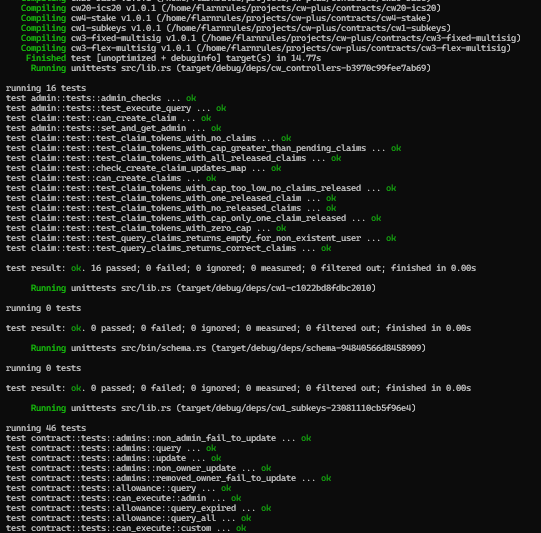

# CosmWasm Quick Start

If you are reading this you probably have some concept of blockchains, cryptocurrencies, the cosmos network, and CosmWasm. You probably have a general idea of the Inter-Blockchain Communication Protocol (IBC) and other concepts related to messages between blockchains.

# Steps

1. Setting up the development environment
2. Testnet setup

## 1 Setting up the develpment environment

To follow the quick start, you will need the following:

1. The Rust Programming Language
2. The Go Programming Language
3. wasmd
4. Docker

### 1.1 Installation

You will need to install the Rust programming language on your machine.

You will need the Wasmrust compiler backend installed in order to build Wasm binaries.
`rustup target add wasm32-unknown-unknown`

Let's break down this command:

- rustup --
- target --
- add --
- wasm32-unknown-unknown --

You will need to install wasmd, which requires the Go programming language.

To install wasmd run the following commands:

`git clone github@github.com:CosmWasm/wasmd.git` // Clones the wasmd github repo
`cd ./wasmd` // change directory into the new repo ./wasmd
`make install` // installs wasmd

### 1.2 Verifying the installation

First we need to verify that the installation was sucessful by running a few tests.

`git clone git@github.com:CosmWasm/cw-plus.git` // clone the cw-plus github repo, a collection of CosmWasm compliant contracts  
`cd ./cw-plus` // go into the cw-plus repo  
`cw-plus $ cargo test` // test all of the contracts in the repo  

You should get an output that looks like this:

## 2 Testnet setup

We will be using the CosmWasm test net malaga-420, which is the generic CosmWasm test net.

The command line tool `wasmd` is configured via environment variables, so we need to set up a `malaga.env` file that sets the proper values. This step is already going to lose a bunch of people unfamiliar with this process, as it lost me the first couple of times I tried to do this.

Let's break this up into multiple sub-steps.

- **2.1:** Create a `malaga.env` file

## 3 

